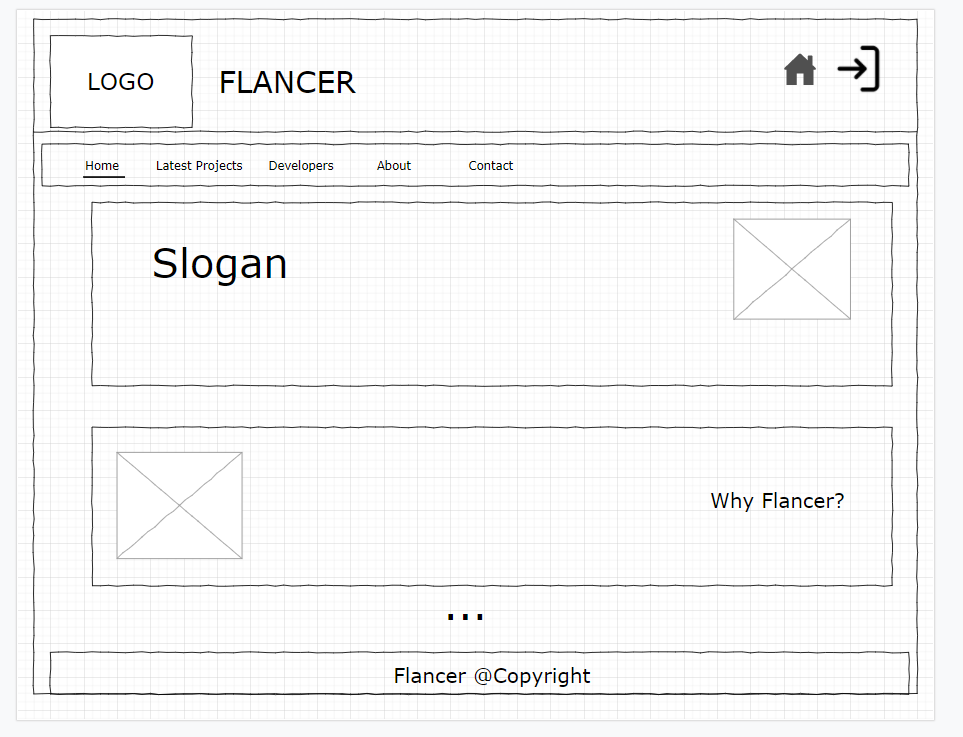
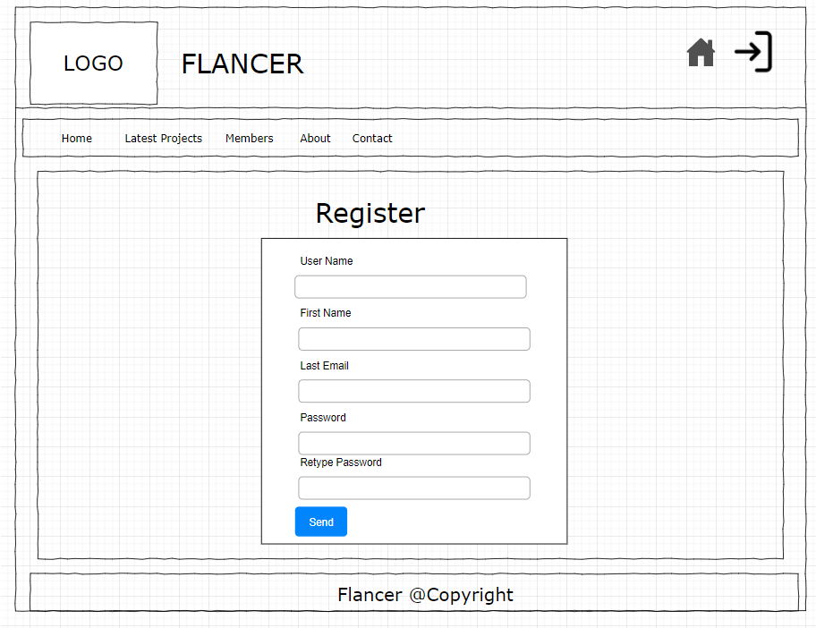
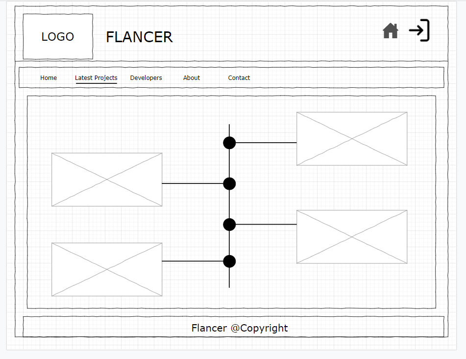
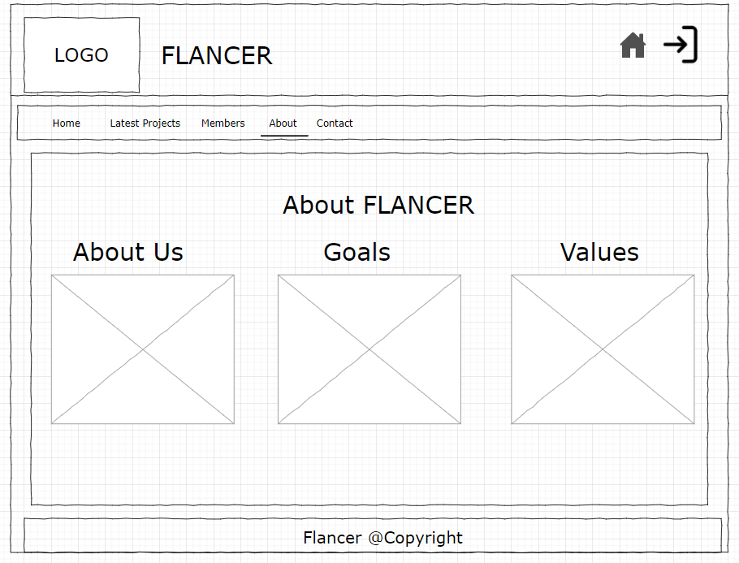
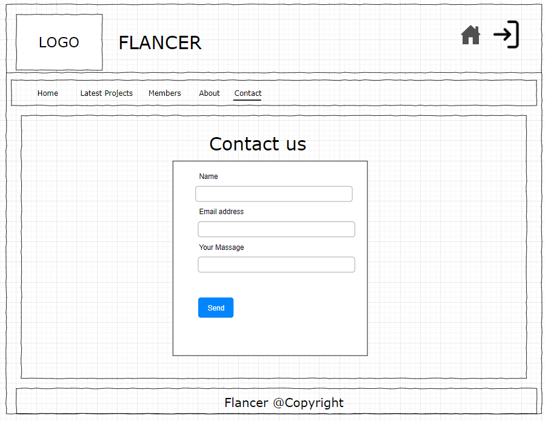
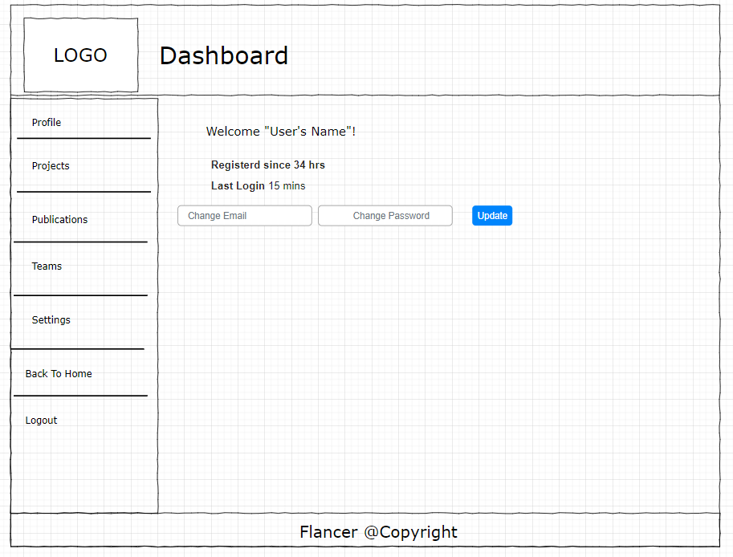
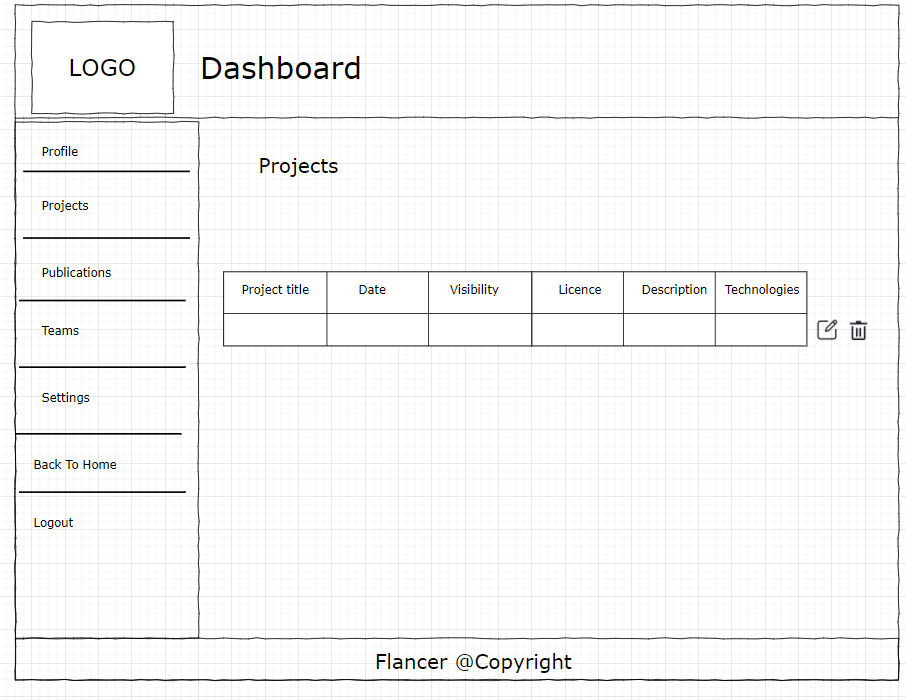
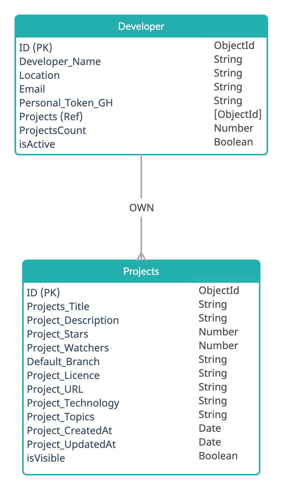
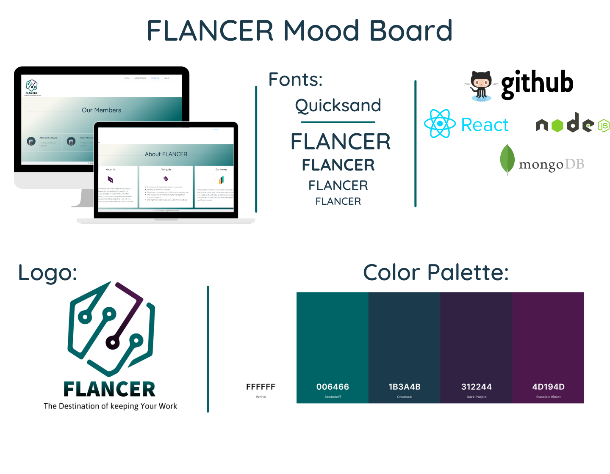

# FLANCER | Web Application

## Table of Contents
1. [Project Discribtion](#Project-Discribtion)
2. [Technologies](#technologies)
3. [User Stories](#userStories)
4. [WireFrames](#WireFrames)
5. [UseCase Diagram](#UseCase&ER)
6. [ER Diagram](#UseCase&ER)
7. [Mood Board](#moodboard)
8. [Development Process](#Development-Process)
9. [Future Goals](#Future-Goals)
10. [Final Result](#Final-Result)
11. [FLANCER Team](#FLANCER-Team)
12. [References](#References)
### Project Discribtion
***
FLANCER is your destination of showing the case of your existing projects,repositories, and designs in detail as a Developer while you are able to share them with other developers, creating a new project along with detailed info, and read, update, delete existing project as well, with the ability to update the project status whether public or private. Flancer will also have visitors with a read-only privilege to give them the ability to read a public project's details. FLANCER is a full-Stack Web Application, we mainly used MEARN technology to implemented it and with differint technologies  to be illustrated.

## Technologies
***
A list of technologies used within the project:
|#| Name |  
| ------ |------ |  
|1| React | 
|2 |Node.js |  
|3 |MongoDB & Mongoose | 
|4 |Ant Design |
| 5|Moment | 
| 6|Axios | 
| 7|Passport | 
| 7|GitHub API |

## User Stories
***
### Creative Stories
1. As a Creative, I should be able to register on the website.
2. As a Creative, I should be able to log in to the website.
3. As a Creative, I should be able to create a new project along with a name, project start date, images, project description, licence, technologies, visibilty, and the website link to the profile.
4. As a Creative, I should be read a single project's info by clicking on it.
5. As a Creative, I should be able to update existing project details.
 6. As a Creative, I should be able to delete the existing project.
7. As a Creative, I should be able to navigate between the website's sections, landing page, latest project, Creatives, about, contact us.
 8. As a Creative, I should be able to change of status a project if public or private.

 ### Visitor Stories

1. As a Visitor, I should be able to navigate between the website's sections.
2. As a Visitor, I should be able to read about any developer's public project by clicking on it.
3. As a Visitor, I should be able to go through a single project's link or the Github repo.
## WireFrames
***

## UseCase & ER Diagram
***
The ER Diagram and Use Case Diagram to clarify the functionalities associated with our users.

## Mood Board
***
Our Mood Board that we got inispired with, along with our logo, color palette, and fonts.

## Development Process
***
Starting with creating the wireframes, ER Diagram, UseCase Diagram and listing the User Stories to visualize the final result and simplify the development process, helps to accomplished the requirements and achieved the goals and stretcher goals.

## Future Goals
***
- Adding the Teams Feature.
- Adding another third-party API
- Adding more functionalites to the dashboard

## Final result
***

## FLANCER Team
***
At FLANCER we collaborated and strived to build a complete Web Application to Keep the works and projects created by our creatives by gathering them in one place as a creative container. Created with passion, care, and love to help anyone suffer from project issues by Abdulaziz Alfayaa, Abeer Albawardi, Amani Alosaimi, and Fahad Alsaedi at SEI-14.

## References
***
- [GitHub API](https://docs.github.com/en/rest/reference/repos)
- [Passport](http://www.passportjs.org/packages/passport-local/)
- [Ant Desigin](https://ant.design/)